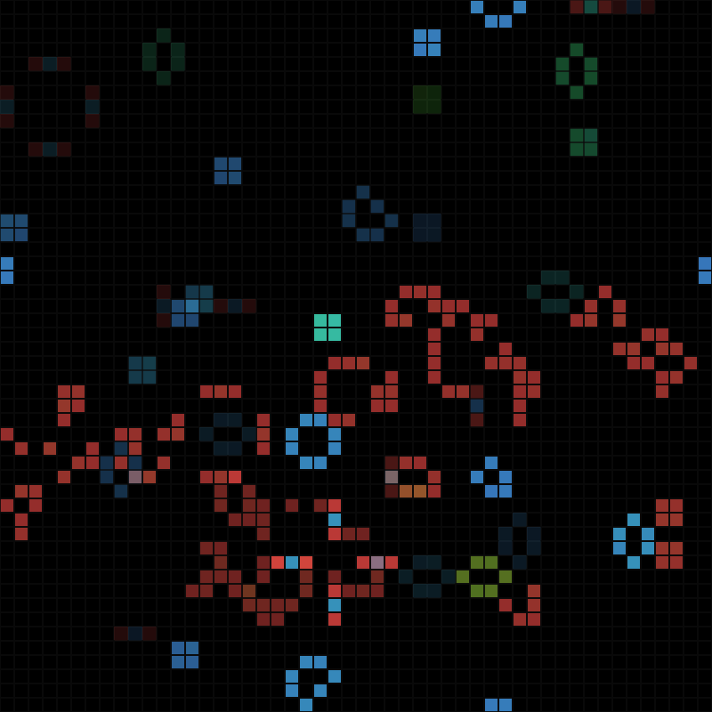

GameOfLife
==========

Conway's Game of Life implemented in Lua (with the LÖVE framework).
Also my first attempt at making something in Lua/LÖVE so have some mercy.

Requirements
----------

* Lua
* LÖVE

Building
----------

    $ love current/directory/of/GameOfLife

Features
----------

* Multiple GOL layers, the opacity of the layers is automatically changed depending on how many layers there are
* Take screenshots using the `screenShotWrapper()` function
* Listen to the pitch of the game (depends on how many cells are present, kinda)
* The hue of the cells is based on how long they've been alive, beyond 255 cycles the hue stays at 255.

Controls
----------

* Pause the game using the `space` button
* Manually add cells by clicking on them (they turn up white)
* Manually reseed the games using the `up` button
* Manually progress the games using the `down` button (only useful in paused mode)

Todo
----------

* Add a control for taking a screenshot, also place the screenshot in a more easily reachable location
* Make it possible to turn your GOL into a gif through a `bash` script (using `convert`)
